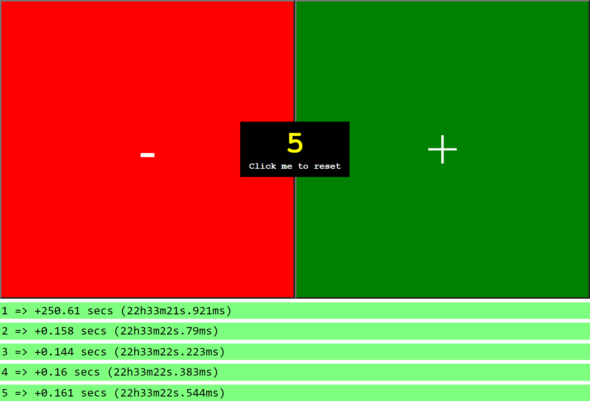

# What's this?

This app helps you count your reps

It is as simple as possible

Use it on your smartphone in landscape mode

The buttons take up the whole width and height of your smartphone for clicking buttons without looking at your screen

There is a sound effect that plays each time you press a button in order to make sure you pressed the (correct) button

Below the buttons, you can see logs and know the delta between each button press

Press the center button to reset the app (counter to 0 and flush the logs)

Scroll down to access the settings and toggle sound effects

# Preview

[Use me here !](https://discolow.github.io/reps-counter/)

# Screenshot

The buttons area take up the whole screen

If you scroll, you can see the press timestamps and delta

# Possible improvements :

- Use computer keyboard arrow keys to increase/decrease score
- Control to invert buttons position
- Control to change layout (up-down instead of left-right)