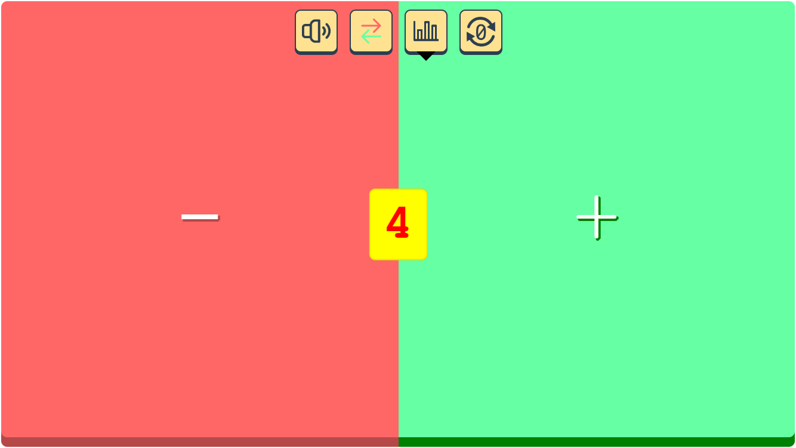
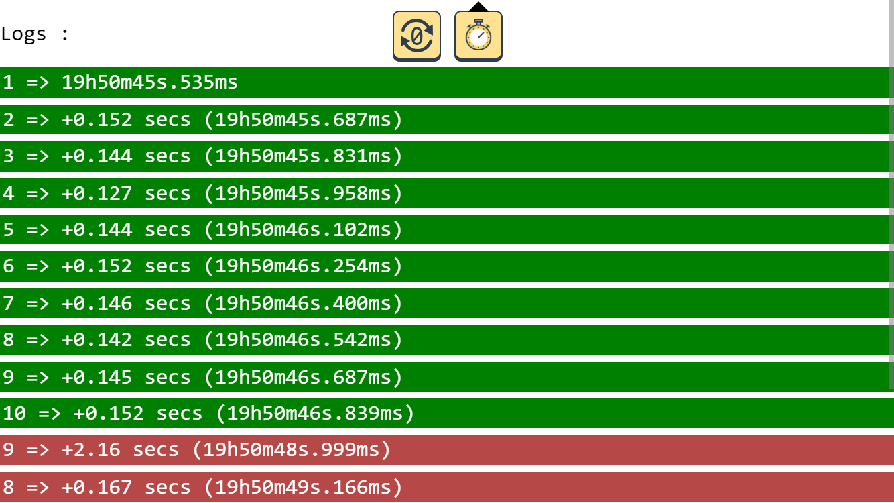

# What's this?

This app helps you count your reps

It is as simple as possible

Use it on your smartphone in landscape mode

The buttons take up the whole width and height of your smartphone for clicking buttons without looking at your screen

There is a sound effect that plays each time you press a button in order to make sure you pressed the (correct) button

Click "Show metrics" to display the delta between each button press

Press the center button to reset the app (counter to 0 and flush the logs)

Add the progressive web app to your homepage on iOS !

# Preview

[Use me here !](https://discolow.github.io/reps-counter/)

# Screenshot

Default view (homepage) :

This is the view when you open the app

The buttons area take up the whole screen

Score is showing in the middle of the screen

You can invert the buttons position to press buttons more easily :

Controls are in the top right corner

You can press "Show metrics" to access statistics

# Moving images

# Possible improvements :

- Use computer keyboard arrow keys to increase/decrease score
- Change buttons color
- Control to change layout (up-down instead of left-right)